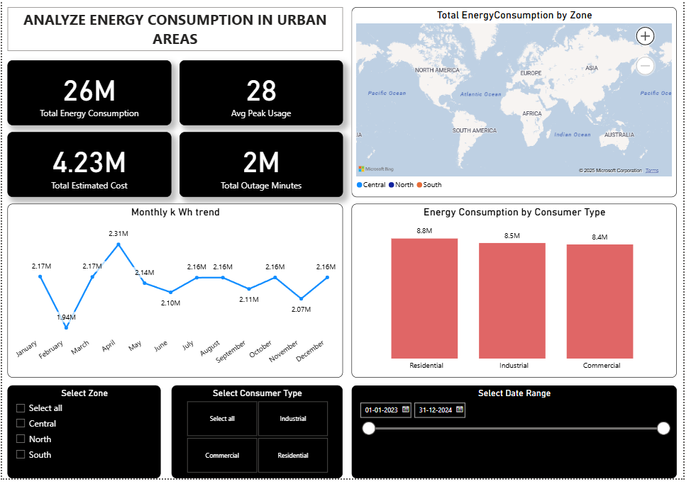

# 🔋 Energy Consumption Analysis in Urban Areas

  
*A snapshot of energy consumption patterns across urban zones*

## 📊 Project Overview
This project analyzes urban energy usage through:
- 🛢️ SQL for data crunching
- 📈 Power BI for visual storytelling

## 🎯 Key Metrics
- **⚡ 26M kWh** Total Energy Consumed  
- **💰 $4.23M** Total Energy Costs  
- **⚠️ 2M mins** System Downtime  
- **📊 28 kWh** Avg Peak Demand

## 🔍 Top Insights

### 🌍 Consumption Patterns
- 🥇 **North America & Europe** - Highest consuming regions
- 🏠 **Residential (8.8M kWh)** - Biggest consumer segment
- 🏭 **Industrial (8.5M kWh)** - Close second
- 📅 Stable monthly usage (~2.1M kWh) with occasional spikes

### ⚠️ Infrastructure Health
- 🔌 **2M outage minutes** detected
- 🚧 Some zones show high outages + high consumption

### 💸 Cost Breakdown
- 📍 North America = Highest costs (high usage + tariffs)

## 💻 Technical Backbone
```sql
/* 7 key SQL queries analyzed: */
1. Zone-wise daily trends
2. Top 5 energy hogs
3. Monthly consumption waves  
4. Cost per zone
5. Faulty meters
6. Inefficient zones
7. Weekend vs weekday demand